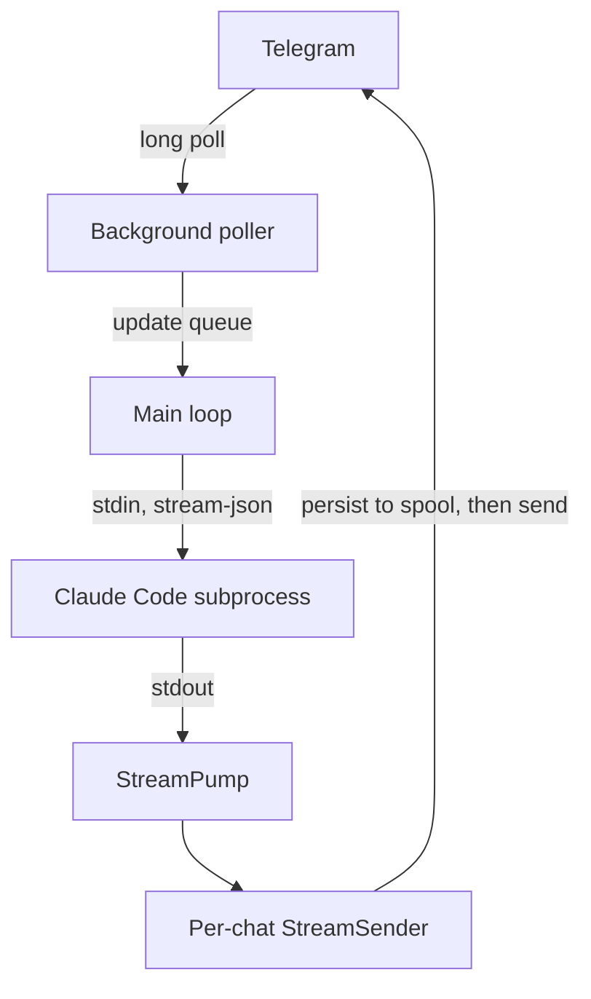

<h1 align="center">claude-landline</h1>

<strong>A phone line to the Claude Code agent living on your machine.</strong>

  
  
  
  

<!-- HERO SCREENSHOT SLOT: phone-width Telegram capture showing a message getting 👀, a streamed reply, then 👌. Ideally a short GIF. -->

---

**[Setup](docs/SETUP.md)** | **[Architecture](docs/ARCHITECTURE.md)** | **[Developer guide](CLAUDE.md)**

Landline is a macOS daemon that puts a Telegram bot in front of a persistent Claude Code subprocess. You text your workstation from your phone, and the reply streams back from the same agent, in the same session, with full access to your tools. Voice notes get transcribed locally. PDFs and text files go straight into context. Reactions on your messages tell you the agent saw them and finished the turn.

If Claude Code is the agent, Landline is the phone in your pocket that rings it.

## Why

The Claude Code CLI is the fullest form of the agent: file system, shell, browser, MCP servers, whatever you've wired up. But it lives in a terminal, and the moment you close the laptop, whatever it was working on waits until you're back at the keyboard.

Landline keeps that agent always-on. Send it a question from the train, or kick off a background task from the couch and get the result as an ordered stream of messages whenever the work finishes.

## Features

### Runtime

- **Persistent Claude Code session**: one long-lived subprocess, one session id, one context, not a chat wrapper that spawns a fresh agent per message.
- **Streaming replies**: Claude's text deltas and tool-status lines merge into a single ordered feed per chat, so status arrives before the reply that references it.
- **Voice notes**: the daemon downloads voice, audio, and video-note messages, transcribes them locally with `whisper`, and passes the text to Claude inside XML delimiters (as content, never as instructions).
- **Documents**: PDFs, text, Markdown, CSV, JSON, TSV, YAML, and logs land in a private cache and reach Claude as file paths it can read.
- **Reactions as ACKs**: 👀 the moment your message is accepted, 👌 when the turn completes.
- **`/status`, `/pause`, `/new`**: a compact system report, an interrupt for the in-flight turn, and a forced fresh session.

### Security

- **Passphrase lock**: the session locks on startup, on `/new`, and on idle expiry, and unlocks when you type the passphrase. Failed attempts hit exponentially escalating lockouts, hard-capped at one hour so you can always recover.
- **Fail-closed allowlist**: a Keychain-stored list of Telegram `chat_id`s is the outer gate. Unauthorized senders get silence rather than an error, so there is no enumeration oracle.
- **Keychain-only secrets**: bot token, chat_id, allowlist, passphrase hash, and iMessage handle all live in the macOS login Keychain. Nothing sits on disk in plaintext.
- **Untrusted content stays delimited**: voice transcripts and document filenames reach Claude inside XML delimiters with close-tag escaping. They are treated as user content, not instructions, and never appear in the daemon log.

### Operations

- **At-least-once outbound**: a disk-backed spool persists every send before dispatch and replays after a crash, because losing a reply is worse than sending a duplicate.
- **Poller self-healing**: the long-poll TCP connection can go stale (`ESTABLISHED` with no data), so the main loop detects the stall and swaps the poller in place without losing updates.
- **Auth-expiry alerts**: if the underlying `claude` CLI starts returning 401s (token expired, org quota exhausted), the daemon fires a one-shot iMessage alert.
- **Zero runtime dependencies**: pure standard library on Python 3.9. A fresh Mac can run this with nothing installed.
- **1,079 tests**: every module has coverage, including the desync-regression tests that make the design of `StreamPump` load-bearing.
- **launchd-supervised**: `KeepAlive` for in-place restarts, plus a separate watchdog plist that re-bootstraps the label if it ever falls off launchd.

## How it works

A single-threaded main loop reads Telegram updates from a background poller, classifies them, and dispatches to one persistent Claude Code subprocess. `StreamPump` drains that subprocess's stdout and routes each turn's output to a per-chat sender, which delivers to Telegram through a persist-first spool.

### One stdout reader, for the life of the process

The most consequential design decision in this repo: `StreamPump` is the *only* reader of the Claude subprocess's stdout, from spawn to exit. The single-reader rule exists because an off-by-one desync bug once attributed replies to the wrong turn and survived for months before this design eliminated it. The full story is in [`docs/ARCHITECTURE.md`](docs/ARCHITECTURE.md#streampump--one-reader-for-the-processs-life).

## Quickstart

See [`docs/SETUP.md`](docs/SETUP.md) for the full walkthrough. The short version:

1. Clone the repo: `git clone https://github.com/Maninae/claude-landline.git`
2. Create a Telegram bot with [@BotFather](https://t.me/BotFather) and grab its token plus your `chat_id`.
3. Store the bot token, `chat_id`, allowlist, and passphrase hash in Keychain (four `security add-generic-password` commands, plus an optional fifth for an iMessage alert handle).
4. Copy [`deploy/landline.example.json`](deploy/landline.example.json) to the workspace directory as `landline.json`.
5. Copy the launchd plist templates from [`deploy/`](deploy/), edit the paths, and `launchctl bootstrap` both plists.
6. Text your bot. Type the passphrase to unlock. You're live.

## Requirements

- **macOS.** Keychain (`security`), launchd, and `osascript` for iMessage alerts are all load-bearing. Portability is out of scope.
- **Python 3.9+.** The system `python3` is fine. No packages to install, the daemon is standard library only.
- **Claude Code CLI**, installed and logged in. Landline shells out to `claude -p --input-format stream-json --output-format stream-json` and reads the resulting stream. You need an active Claude subscription (or API-key configuration) with headless jobs allowed.
- **A Telegram bot.** Message [@BotFather](https://t.me/BotFather) to create one. Free.
- **Optional: whisper** on your PATH for voice-note transcription (`brew install openai-whisper`). Documents work without it.

## Limitations

The honest list:

- **macOS-only.** Not by philosophy but by dependency: Keychain, launchd, and iMessage are wired throughout, and cross-platform would be a rewrite.
- **Single-user by design.** One passphrase, one session, one context. There is no multi-tenant story and there won't be. If you want per-user contexts, run more than one Landline (different Keychain accounts, different plist labels).
- **Tightly coupled to Claude Code's `stream-json` contract.** If the CLI changes its event framing (`system/init` … `result`) or its unsolicited-turn behaviour, the `StreamPump` invariants will need to move with it. The suite covers the current contract; a version bump of the CLI should trigger a re-run before you deploy.
- **`bypassPermissions` is the default.** This is what makes the always-on agent experience work: an agent that pauses every 20 seconds to ask "run this bash command? [y/n]" isn't messageable from a phone. It also means anyone on the allowlist who knows the passphrase can run shell as your user. Treat this the way you'd treat SSH access; see [`docs/SETUP.md`](docs/SETUP.md#the-bypasspermissions-warning) for the fuller discussion.
- **Requires a paid Claude subscription (or API-key setup) with headless jobs enabled.** Not something Landline itself provides.
- **No web UI.** Telegram is the interface, on purpose.
- **Not affiliated with or endorsed by Anthropic.** "Claude" and "Claude Code" are Anthropic's; this project is an independent client that talks to Anthropic's CLI.

## License

MIT. See [`LICENSE`](LICENSE).

Copyright © 2026 Owen Wang.
