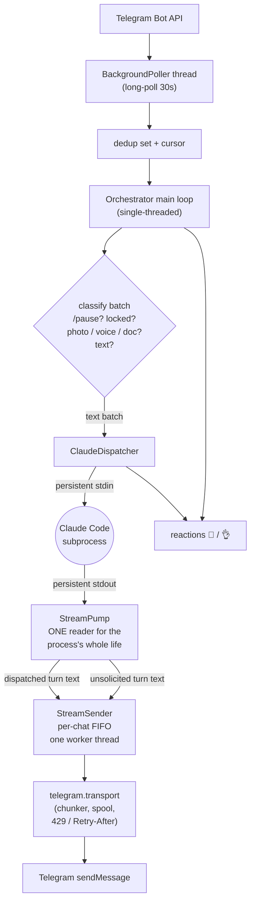
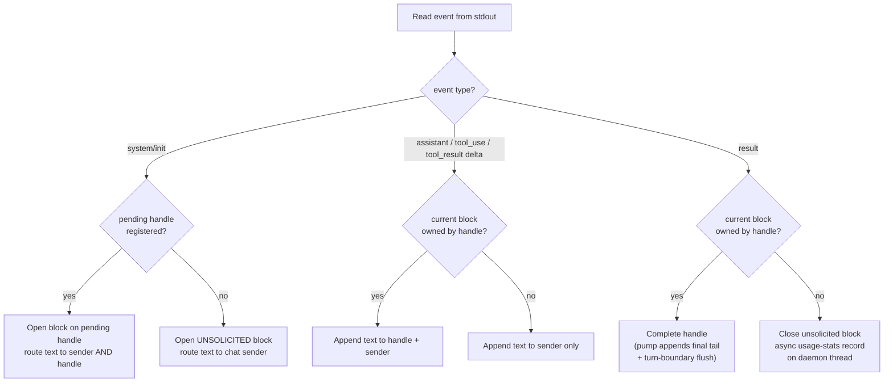
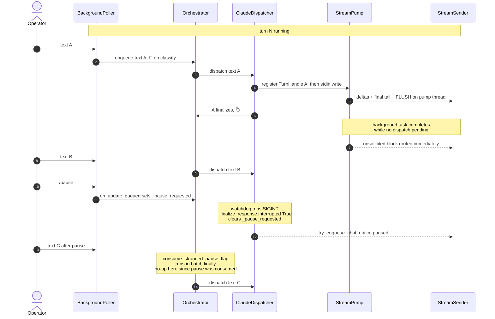

# Architecture

Landline is a Python 3.9, stdlib-only, macOS-targeted daemon. It bridges
Telegram to a **persistent** headless Claude Code subprocess so that a phone
becomes the front door to an always-on agent on your workstation. This
document walks the moving parts and the invariants that keep them honest.

If you're new to the codebase, skim this end-to-end before diving in. The
StreamPump section in particular is the load-bearing story of the whole
repo — the design there is not incidental.

---

## The shape of a message

A dispatched turn round-trips through the same pump and sender that also
carry background-turn output. Everything downstream of the orchestrator is
built to keep those two streams from stepping on each other.

---

## Module map

The package is 41 focused modules across five subpackages (excluding
`__init__.py` files and the `tests/` tree). Each subpackage groups one
concern; `orchestrator/` is the coordinator. Two thin facade `__init__.py`
modules (`landline.claude`, `landline.telegram`) exist to keep import paths
stable across internal refactors — always import from the subpackage
facade, never the sub-module.

**This is the single canonical module table for the repo.** Both
`CLAUDE.md` and `README.md` link here rather than duplicating it.

### Top level

| Module | Purpose |
|---|---|
| `__main__.py` | Entry point — PID flock, fatal-crash pause, top-level wiring |
| `config.py` | Constants + `landline.json` loader — no side effects on import |
| `telegram_fmt.py` | Three-line compat shim (`from landline.telegram.fmt import *`) for out-of-tree cron scripts |

### `orchestrator/` — daemon coordinator

| Module | Purpose |
|---|---|
| `__init__.py` | Facade — delegates attribute access to `daemon.py` so `patch("landline.orchestrator.X")` reaches the coordinator's globals |
| `daemon.py` | `TelegramDaemon` class — init / lifecycle / cursor / main loop / thin delegators |
| `batch.py` | Module-level batch functions (`process_update_batch`, `run_batch_classification_and_dispatch`, `handle_pause_updates`, `process_commands`, `check_lock_gate`, `inject_and_dispatch`, `process_text_batch`, `coalesce_messages`, `consume_stranded_pause_flag`) — all take `daemon` as first arg; state stays on the daemon object |
| `restart.py` | `handle_restart_continuation` — the two-phase trigger-file unlink |
| `poller_health.py` | `check_poller_liveness` + `replace_poller_in_place` — in-process swap of the poller when the long-poll socket goes stale |

### `claude/` — Claude subprocess I/O + turn lifecycle

| Module | Purpose |
|---|---|
| `__init__.py` | Facade re-exporting the Claude-core sub-modules (canonical import path) |
| `persistent.py` | `PersistentClaude` subprocess manager + singleton + live session-id ownership |
| `pump.py` | `StreamPump` — the sole stdout reader; turn demux + unsolicited-turn delivery |
| `streaming.py` | `run_claude_streaming` turn lifecycle (register handle → wait) + watchdog + typing |
| `dispatch.py` | `ClaudeDispatcher` — call lifecycle, backoff, finalization, session-id decisions |
| `predicates.py` | `looks_like_stale_session`, `looks_like_pruned_resume`, `is_result_successful`, `_stderr_looks_like_auth_failure` — pure decision helpers |
| `sender.py` | `StreamSender` + worker loop + queue constants (text + status, one ordered queue) |
| `registry.py` | Per-chat long-lived sender registry + `try_enqueue_chat_notice` |
| `tool_status.py` | tool_use → status-line formatters |
| `failure_tracker.py` | Consecutive-failure tracker + exponential backoff state machine |
| `pause_flag.py` | `PauseFlag` — generation-aware `/pause` interrupt flag |
| `types.py` | Leaf — `ClaudeStreamResult` only; breaks the `dispatch`↔`streaming` cycle. No imports from the rest of `landline.claude` |

### `telegram/` — Telegram I/O

| Module | Purpose |
|---|---|
| `__init__.py` | Facade re-exporting the Telegram I/O sub-modules |
| `transport.py` | HTTP path — `telegram_api`, `send_response`, 429 / Retry-After, bounded retry, `_send_chunk` + `_send_with_retry` |
| `typing.py` | `send_typing` + thread-local pooled `HTTPSConnection` for `sendChatAction` |
| `chunker.py` | Tag-aware HTML chunker + `send_html` (Telegram 4096 / UTF-16 safe) |
| `download.py` | `download_file` — `getFile` + byte-capped streaming |
| `poller.py` | `BackgroundPoller` — long-poll thread, bounded dedup set, cursor advance |
| `reactions.py` | 👀 received → 👌 done — single FIFO worker, fire-and-forget |
| `spool.py` | Disk-backed at-least-once outbound send spool |
| `fmt.py` | Shared markdown → Telegram HTML formatter |

### `media/` — inbound media handlers

| Module | Purpose |
|---|---|
| `photo.py` | Photo batch processing + album grouping + download dispatch |
| `voice.py` | Voice / audio pipeline — download → transcribe → delimited dispatch |
| `transcribe.py` | Local whisper subprocess wrapper (timeout, pause-aware kill) |
| `document.py` | Document pipeline — sanitized basenames, XML-delimited untrusted filenames, allowlisted types |
| `cache.py` | `cache/telegram_images/` age-based retention sweep |

### `runtime/` — plumbing shared by everything

| Module | Purpose |
|---|---|
| `state.py` | Atomic state save, conversation log append, JSONL usage parse |
| `logging.py` | Rotating file + stdout logger |
| `security.py` | `keychain_get` / `keychain_get_status` wrappers |
| `guard.py` | Allowlist gate — fail-closed, 60s Keychain cache |
| `notifications.py` | iMessage alerts (poller stall, Claude auth expiry) — off-thread osascript |
| `inject.py` | Just-in-time context queue prepended to next Claude turn |
| `commands.py` | `CommandRouter` — `/new`, `/status`, unknown |
| `lock.py` | `LockManager` — passphrase, lockout, idle expiry |
| `batch_classifier.py` | Update-batch classification (Pass 1) + `_is_pause_command` |
| `usage_stats.py` | Per-day turn / token / notional-cost counters surfaced in `/status` |

---

## StreamPump — one reader for the process's life

This is the design decision the rest of the daemon is built around.

### The bug

Claude Code's persistent process is not a request-response protocol. When a
background task (a subagent, or a shell command started with
`run_in_background`) finishes, the harness starts a **turn that nobody
asked for**. That unsolicited turn writes a full `system/init` → assistant
events → `result` block to stdout with no matching stdin write. Verified
empirically against the local `claude` CLI: after a `result`, a finished
background task emits `system/task_notification` → `system/init` →
`assistant`… → `result` on stdout with no stdin write at all.

The original design attached a fresh reader per dispatched turn and read
"until the first `result` event". When a background task completed while
no turn was in flight, its events piled up unread in the stdout pipe. The
next dispatched turn's reader consumed the stale block, hit the stale
`result`, and returned — leaving that turn's actual response sitting in
the pipe for the next reader to pick up.

The observable symptom: every turn delivered the *previous* turn's answer.
A → nothing → B → A' → C → B' → … until a restart or `/new` killed the
process. It survived for months (2026-06 through 2026-07). It was first
misattributed to a Telegram client bug, then to send-retry drops. Both
wrong. The bug was in *our reader's contract*: readers cannot detach from
a shared pipe.

### The fix

`landline/claude/pump.py` inverts the ownership. Exactly one `StreamPump`
is created per subprocess (`get_or_create_pump(proc)`, weak-keyed
registry) and reads stdout continuously for the process's life. Nothing
else may read that pipe.

- **Turn blocks are delimited** by `system/init` … `result`. Every turn
  — dispatched or unsolicited — opens with `init`.
- **Dispatched turns register a `TurnHandle` BEFORE their stdin write.**
  The next `init` after registration is attributed to that handle. Events
  route to the per-chat `StreamSender` AND accumulate on the handle; its
  `result` completes the handle.
- **Unregistered blocks are unsolicited.** Their text is routed to the
  chat's sender immediately — background subagent results reach the
  operator when they finish, not one message later.
- **A registered handle is ALWAYS completed** (result / EOF / read
  error). Dispatch can never hang on an abandoned turn.
- **If the pump thread dies while the process lives**, the pipe's read
  position is unknowable. `run_claude_streaming` kills and respawns the
  process. Session id survives on `PersistentClaude` so continuity is
  preserved. Never create a second pump for a live process.

### Turn attribution

### The attribution race (deliberately unfixed)

If a background turn begins in the sub-second window between
`register_turn` and the dispatched turn's `init`, attribution can swap.
Stream order is authoritative and the two blocks are indistinguishable
in-band. All text is still delivered to the sender either way, so
nothing is lost and nothing hangs; in the common idle case the dispatched
turn's real output simply arrives as an unsolicited block moments later.

Only if a follow-up dispatch is already queued (rapid-fire messages
overlapping a background completion) can attribution skew by one turn
until the burst ends — a rare, compound-race, self-healing echo of the
old bug, not a persistent state. A sharper edge inside the same race: if
the misattributed background block happens to be the empty-clean-exit
shape, the dispatched turn's result can look stale
(`looks_like_stale_session`) and trigger a fresh-session retry —
background turns essentially always carry content, so this is a
compound-compound rarity.

**Do NOT "fix" any of this with task-notification counting.** A miscount
can orphan a dispatched turn (a hang), which is strictly worse than
cosmetic skew.

### Watchdog note

`_touch()` bumps the pending turn's activity clock on every event,
including another block's. Deliberate parity with the old reader: the
shared pipe was always the timing signal, and scoping activity to the
owned block would let a >`CLAUDE_TIMEOUT` background turn get a healthy
process killed while a dispatch waits behind it.

### Pump is sole producer for turn tail + flush

The final-result tail and the turn-boundary flush happen on the **pump
thread**, before the handle completes. The pump must be the sole producer
of turn content on the per-chat sender. If the dispatch thread appended
the tail after `handle.done.wait()`, a back-to-back unsolicited block
already sitting in the pipe would race its text in between this turn's
deltas and the tail/flush — welding background text into this turn's
bubble and orphaning the tail into the next one. Reproduced 100% with
back-to-back events. As a consequence, `run_claude_streaming` must not
touch the sender after `handle.done.wait()` returns.

### The watchdog must close stdout if the process dies

If the Claude subprocess dies while a grandchild process still holds
the write end of its stdout pipe, the pump would block forever in its
read loop — the pipe never reaches EOF. The streaming watchdog detects
`proc.poll() is not None` and closes stdout from the outside to unbreak
the reader. Without this, a crashed Claude with an orphaned child would
hang the dispatched turn until restart.

### Usage-stats fsync back-pressure hazard

`usage_stats.record_turn` performs synchronous `os.fsync` inside its
module-level `_lock`. Calling it from the pump thread would let a
competing dispatch-thread `record_turn` (holding `_lock` during an SSD
stall) stall the pump — Claude's stdout pipe would fill and back-pressure
the subprocess, breaking the "pump reads continuously for the process's
life" invariant. Unsolicited-block usage records dispatch to a short-lived
daemon thread so the pump returns immediately; the daemon thread can
afford to block on the lock and fsync. Dispatched vs unsolicited (background
subagent / `run_in_background` completions) are bucketed separately so the
operator can distinguish "my messages" cost from "background" cost.

---

## StreamSender — one ordered queue per chat

Claude's output is not just text — a single turn interleaves prose deltas
with tool-status lines ("running Bash: `ls -la`", "reading `foo.py`").
Both go to Telegram, and their relative order matters: a status line
about a tool call needs to arrive before the reply that references its
result.

The chosen design is one FIFO queue and one worker thread per chat, both
long-lived for the daemon's whole life. The queue carries `(tag, payload)`
tuples where `tag` is TEXT or STATUS. The worker coalesces same-type
runs (text with `STREAM_BUFFER_WINDOW`, status with
`STATUS_BUFFER_WINDOW`) and forces a flush on every type transition —
that's what preserves the ordering guarantee across two heterogeneous
streams without any cross-thread synchronization primitives.

### Why long-lived, not per-turn

Senders are **long-lived, one per chat**, kept in a module-level registry
keyed by `chat_id` (`landline/claude/registry.py`). They are NOT created
per turn. This kills the whole drain-stall / desync class of bugs:

- One FIFO queue + one worker per chat ⇒ bubbles deliver in enqueue order
  **across turns**. Dispatch is single-threaded (`orchestrator.run()`),
  so turn N fully enqueues (including its trailing FLUSH) before turn
  N+1 begins.
- End-of-turn calls `sender.flush()` — a non-blocking FLUSH boundary,
  **never** `close()`. The dispatch thread never blocks on Telegram's
  send rate. A slow turn delays the *next* turn's bubbles in order — it
  never freezes the daemon, drops, or reorders them. The old per-turn
  blocking `close()` was what stalled the dispatch thread up to 30 s
  and then abandoned the worker, leaking an in-flight bubble past the
  turn boundary = desync.
- `close()` runs **only at shutdown**, via `_close_all_senders()` from
  `drain_for_shutdown`. `_drain_remaining()` is the shutdown-only
  safety net that honours FLUSH / type transitions.
- The worker is hardened: `_run` wraps each entry in catch-log-continue,
  and `_get_or_create_sender` self-heals by recreating a sender whose
  worker thread has died.
- The queue is intentionally unbounded — dropping is the bug we avoid.
  A backlog past `_QUEUE_HIGH_WATER` logs once so it's observable.

### Daemon notices routed the same way

Notices generated by the daemon itself — "(Paused.)", "(Still working…)",
context-window warnings, empty-response fallbacks — enqueue through
`try_enqueue_chat_notice(chat_id, html=/text=)`. They land **after** any
draining bubbles, preserving the invariant that a status line about a
tool arrives before its reply. Each caller keeps a direct-send fallback
for the case when no live sender exists yet (before the first turn to a
new chat).

Out-of-band **health alerts** (backoff gate, "Claude unavailable") stay
direct-send. Immediate delivery beats ordering when the queue itself
might be the thing that's stuck.

### Sender fallback goes through iMessage, not Telegram

When the per-chat text-send callable fails N times in a row, the sender's
"we lost your reply" fallback notice used to re-use `self._text_send_fn`
— the very callable that just failed. That notice reliably never landed.
`_record_emit_failure` now routes the alert through
`landline.runtime.notifications` (async iMessage) so the operator hears
about it even when Telegram is the thing that's broken.

---

## Session id — single source of truth

`PersistentClaude` owns the live session id (`get_session_id()` /
`set_session_id()`, guarded by the existing `_lock`).
`state["session_id"]` is a write-on-save serialization slot,
lazy-seeded into pc on the dispatcher's first `send_to_claude`.

- The dispatcher routes all session-id decisions through pc.
- `_retry_with_fresh_session` clears pc BEFORE state.
- `_finalize_response` always mirrors pc into state before save (so an
  interrupted / exit-143 turn can't clobber the session).
- `_reset_persistent_claude_for_new` in `orchestrator/daemon.py` goes
  through the `landline.claude` facade (the test patch surface) rather
  than importing `landline.claude.persistent` directly — mirrors the
  lazy import the dispatcher uses. **Kill the process FIRST, then
  clear the session id**, so a brief window where the subprocess is
  dead but the id still set is preferable to one where pc claims a new
  (nil) session while the old subprocess is still draining.

### Stale-resume vs mid-session error discriminator

A pruned `--resume` (verified empirically against the CLI) emits a bare
`result` event with `subtype=error_during_execution`, `is_error=true`,
NO preceding `system/init`, exit code 1, and stderr containing "No
conversation found with session ID: <uuid>".

The distinguisher from a mid-session API error (also `is_error`) is
whether `saw_init=True` on this turn:

- Pruned resume: no init on the failing turn (`saw_init=False`) — routes
  into `_retry_with_fresh_session`.
- Mid-session error: init happened on this turn (`saw_init=True`) —
  preserved so a genuine mid-session failure isn't wiped into a fresh
  session (destroying conversation context).

`looks_like_stale_session` catches clean-empty (exit 0 / None, no
content); `looks_like_pruned_resume` catches `is_error` + no-init (with
the stderr marker as belt-and-suspenders for the pump-missed-init edge).

**Corroborating stderr required for a session wipe.** `is_error` +
no-init ALONE is ambiguous with the "pump missed init" path — a
`JSONDecodeError` on the `system/init` line leaves `saw_init=False` on
the handle even for a healthy mid-session turn that later failed. Real
pruned-resume ALWAYS emits "No conversation found with session ID" (or
"session not found") into stderr; demand the marker before nuking a
session.

**Auth-failure collision guard.** A CLI auth failure also produces the
`is_error` + no-init shape (401 happens before any `system/init`). If
classified as pruned resume it would (a) show the misleading "(Previous
session expired, starting fresh.)" notice, (b) wipe the still-valid
server-side session UUID, and (c) delay the real auth alert by an extra
failed retry. Detect the auth stderr shape first and hand the result to
the auth-alert path unmolested.

**Pump ordering.** In `_open_block`, mark `saw_init` BEFORE recording
`session_id` — so the ordering matches the load-bearing distinguisher.

---

## Outbound spool — at-least-once send

Telegram's HTTP API sometimes takes tens of seconds to acknowledge a
send, and the underlying TCP connection can silently drop mid-flight.
Losing a reply is worse than sending a duplicate — the operator can
recognize a duplicate; a missing reply is invisible.

`landline/telegram/transport.py` handles this with a persist-first
outbound spool:

- Every chunk handed to `_send_with_retry` is written to disk at
  `cache/telegram-outbound-spool/{epoch_ns}-{uid}-{state}.json` **before**
  the HTTP send.
- The file is renamed to `-inflight-<pid>.json` while the send is in
  flight, unlinked on a confirmed 200, and renamed back to `-pending`
  on final retry-exhaustion.
- A background thread + a synchronous startup pass replay pending files.
- Files under `WORKSPACE / cache / telegram-outbound-spool` at 0o700;
  JSON payloads at 0o600.
- Age (`SPOOL_MAX_AGE_SECONDS`, 24 h) and count (`SPOOL_MAX_FILES`, 500)
  caps trade duration and disk cost against staleness — a stale morning
  brief replayed hours later is worse than no brief; 500 max files
  caps disk to ~2 MB of 4 KB chunks.
- A minimum-age gate (`SPOOL_REPLAY_MIN_AGE_SECONDS`, 5 s) keeps the
  replayer from stealing a send that the primary path is still working
  on. The `-inflight-<pid>` rename guards the same case.
- `_spool_replay_send` bypasses `_send_with_retry` (which would
  re-persist the file into a fresh inflight state, defeating the point)
  and hits `_send_chunk` directly. A single attempt per replay pass —
  the periodic loop is the retry vehicle.

The trade: a rare duplicate send on a timed-out-but-delivered request is
accepted. Optimizing the persist-first ordering away (persist after
send) would silently drop chunks on any crash mid-send. Don't.

The synchronous `replay_all` pass that used to run at startup was
removed: it could block startup for tens of minutes when Telegram was
unreachable (~200 files × 10 s urlopen timeout each). The background
replayer's first tick provides identical coverage without the
availability hole.

### Send-retry backoff

`SEND_MAX_ATTEMPTS = 5` with backoffs `(1, 2, 4, 8)` seconds rides out
the ~15–35 s TLS/handshake stalls flaky networks show in the daemon log.
The earlier 3 attempts / `(1, 2)` schedule gave up ~4 s in, silently
dropping the reply. 429s honor the advertised delay, clamped between
`SEND_RETRY_AFTER_FALLBACK` and `SEND_RETRY_AFTER_CAP`. A rare duplicate
send on a timed-out-but-delivered request is an accepted trade against
silent drops.

---

## Reactions — 👀 → 👌

Two Bot API `setMessageReaction` calls per turn:

- 👀 (eyes) at classify time, once the update passes the guard and the
  lock is unlocked. Tells the operator "I saw this; queued or working".
- 👌 (OK hand) on turn completion.

This runs on a single persistent worker thread draining a FIFO queue.
SET / CLEAR pairs for the same message must never race each other on
separate threads (the API is order-sensitive), which is why the queue is
FIFO and single-worker rather than a thread pool.

Reactions are fire-and-forget: a failure must never delay or fail message
processing. The reaction path is entirely off the dispatch critical path.

### The ack_message_ids contract

`ack_message_ids` names ONLY the Telegram message_ids actually being
dispatched in this turn — passed by each media handler from the
messages it's dispatching right now. On a successful finalize,
`ClaudeDispatcher` fires 👌 on exactly those ids.

- Mixed batches (voice + text, photo + text, multi-doc) each get their
  own dispatch. A failed dispatch (e.g. whisper failure) never lets a
  later successful dispatch cross-pollinate 👌 onto messages that were
  never processed.
- The per-batch tracker (`_batch_ack_message_ids`) is populated by the
  classifier for observability/tests but NOT read in
  `inject_and_dispatch`; the caller owns which ids to ack for its own
  dispatch. Callers with no ids (e.g. restart continuation) pass
  `None` / empty.
- Dispatched ids are popped from the per-batch tracker so a subsequent
  dispatch in the same batch (e.g. text after voice) cannot see them
  and re-👌 messages that don't belong to it.
- Backoff-queue hardening: drained-queue entries were 👀-acked when
  originally queued; the 👌 for them fires on the successful call that
  finally delivers their merged text. Prepend so ordering matches
  `[queued 1..N, current]`.
- Completion 👌 fires only on a genuinely successful turn — not on
  interrupted (leave 👀 as a persistent "you paused this" visual) and
  not on failure (leave 👀 so the user knows nothing landed).

Every 👀 must reach 👌 or CLEAR on every exit path — locked, paused,
overflow, batch-error, brush-off. Several review rounds have been spent
pinning down every bail-out branch. Consult the reaction tests before
touching any of them. Kill switch: set `"reaction_acks_enabled": false`
in `landline.json`.

---

## Poller self-healing

The long-poll TCP connection can go stale — the socket sits in
`ESTABLISHED` state indefinitely, no data flows, no error is raised. The
daemon looks healthy (process alive, thread alive) but stops processing
messages.

Two mitigations:

- **Timeout on `urllib`.** The poller passes `POLL_TIMEOUT + 10` to
  `urlopen`. A truly wedged socket can evade this — some macOS TCP
  states don't fire the read timeout — but it catches most cases.
- **In-process replacement.** The main loop tracks
  `poller.last_successful_poll_at`. If no successful poll lands within
  `POLL_STALE_ALERT_THRESHOLD_SECONDS` (7 minutes, comfortably past
  `POLL_TIMEOUT` (30 s) + `POLL_ERROR_BACKOFF_MAX` (300 s)), the
  orchestrator swaps the poller in place while preserving the dedup-set
  and cursor state. The replacement is invisible to Telegram — no
  update is lost, no cursor rewinds.

### In-process swap sequence (`replace_poller_in_place`)

1. `signal_stop()` the old poller. Never `stop()` — its join can wait
   `POLL_TIMEOUT + 5`, stalling the main loop on top of an
   already-stalled poller.
2. Snapshot the dedup set and cursor.
3. Construct the new poller with the snapshotted cursor.
4. Hand the dedup snapshot to the new poller.
5. Attach a fresh `_on_update_queued` callback.
6. Start the new poller.
7. Let the old poller thread die on its next timeout (daemonized).

**Dedup + queue snapshot race.** The old poller thread may have
atomically added an update to (dedup ∪ queue) AFTER `snapshot_dedup_ids()`
returned but BEFORE `old.drain()` — that update lands in the drained
payload without ever appearing in `old_dedup`. If we skipped it, the new
poller's cursor (snapshotted before the update was processed) would ask
Telegram for offset=X on the next poll, get X re-delivered, miss the
dedup gate, and re-queue X → main loop processes X twice. Seed the
forwarded ids into dedup so re-delivery is a dedup hit (at-most-once
across the swap).

**Orphaned-queue forwarding.** Drain updates that were already queued on
the old poller but not yet consumed by the main loop, and preload them
onto the new poller. Without this, they'd be orphaned (old poller
stops, main loop only reads new poller's queue, Telegram's re-delivery
blocked by new poller's dedup) — silently lost updates.

**Rationale for in-process (vs process exit):** keeps the persistent
Claude subprocess and the StreamSender queue backlog alive across the
swap.

### Network vs code-error partition (in `_poll_loop`)

- **Network-layer errors** (`URLError`, `socket.timeout`, `TimeoutError`,
  `OSError`, incl. Telegram 429 as `HTTPError`) drive the outage timer,
  iMessage alert, and exponential backoff. 429 honors `Retry-After`
  (header → JSON body → current backoff).
- **Non-network errors** (`RuntimeError` from a not-ok API response, or
  code bugs like `KeyError` / `TypeError` from a malformed payload)
  MUST NOT touch the outage timer or send a "network outage" alert —
  those signals are reserved for genuine connectivity loss so they
  stay meaningful. Short fixed backoff instead of exponential
  escalation. Throttled log: first + every Nth; non-`RuntimeError` code
  bugs get the full traceback on the first hit only.

### Dedup set is never pruned on cursor advance

The poller keeps a bounded-growth set of seen `update_id`s. It is
deliberately **not** pruned when the cursor advances: an in-flight long
poll can return updates the main thread already processed, and if their
ids had been pruned they would be re-queued and double-processed. The
set grows by one `int` per message — negligible over the daemon's
lifetime. (`advance_processed_cursor` carries the same invariant as a
docstring bullet.)

### Auth-expiry outage alert

An auth-expiry alert (once-per-incident latched, reset on next success)
fires the async iMessage path if the Claude CLI itself starts returning
401s. This catches the class of failure where `claude -p` jobs die
silently for hours — verified against a real multi-day June-2026 outage,
during which the operator only learned about it days later when someone
else noticed the silence.

- The auth-stderr matcher (`_stderr_looks_like_auth_failure`) fires on
  the FIRST match, not the tenth consecutive failure like the in-band
  "Claude unavailable" notice.
- Match generously (case-insensitive): Anthropic-CLI strings drift and
  change without notice; the cost of a false positive is one iMessage
  the operator can ignore — strictly better than missing a multi-day
  outage.
- HTTP-401 shapes are anchored (e.g. `" 401 unauthorized"`, `"http 401"`,
  `"status: 401"`) so bare `"401"` doesn't false-positive on port
  numbers, pids, hashes, or "processed 401 files".
- One-shot latch (`_auth_alert_sent`) + a defensive 6 h floor
  (`CLAUDE_AUTH_ALERT_MIN_INTERVAL_SECONDS`). **The floor MUST run
  unconditionally** — a fail → success → fail cycle resets the latch
  on the success, so gating the floor behind the latch would let a
  second alert fire milliseconds after the first. Defense-in-depth
  against exactly that reset race.

### iMessage alert transport

- `osascript` runs on a short-lived daemon thread
  (`_run_osascript_in_thread`) so a hung AppleScript event or slow
  Messages handoff can't block the poller, dispatcher, or StreamSender
  worker that fired the alert.
- Transport:
  `osascript -e 'tell application "Messages" to send "<body>" to participant "<handle>"'` —
  mirrors `deploy/watchdog.sh`. Replaced an earlier per-user CLI dep
  that silently no-op'd on any machine without it, making the
  auth-expiry / network alerts inert.
- `send_health_alert` returns `True` iff the alert thread was started;
  callers gate one-shot latches on that so a missing owner handle
  doesn't trip the latch and swallow future alerts.

---

## The queueing + `/pause` contract

The dispatch thread is single-threaded. When Claude is mid-turn, incoming
Telegram updates queue up on `BackgroundPoller._incoming_updates_queue`
rather than interrupting. Interruption is opt-in — `/pause` is the only
message that interrupts a running turn.

The rules are strict because the race surface is subtle:

- `/pause` is intercepted **before** `/`-prefix routing in
  `process_update_batch`, so it never reaches `CommandRouter`.
- `_pause_requested` is a `PauseFlag` — generation-aware. A stale pause
  from a previous turn cannot interrupt the next one.
- `_pause_requested` is **set** only by the poller's `on_update_queued`
  callback.
- `_pause_requested` is **cleared** only in (a) `_finalize_response`
  when the result is interrupted, and (b) `handle_pause_updates` when
  no dispatch is pending in the same batch.
- **Never clear `_pause_requested` at the start of `_invoke_claude_call`
  — it races with the watchdog when `/pause` arrives in the same batch
  as text.**
- `MAX_QUEUED_UPDATES` (30) caps drained updates per loop iteration.
  Overflow gets a "dropped N messages" notice. The cap is applied after
  drain, before classification, so text + photos + commands share one
  budget.
- The `on_update_queued` callback contract is O(1), non-blocking,
  exception-isolated (exceptions must NOT increment
  `consecutive_error_count`).
- Callback queries are discarded. The orchestrator advances the cursor
  and `continue`s without calling `answerCallbackQuery`. If a button
  flow is ever re-introduced, the ACK must be sent off the main loop —
  Telegram times out button presses after ~30 s and the main loop can
  be blocked for minutes during a Claude call.

### Deferred /pause: stranded-flag consumer

When `handle_pause_updates` sees `dispatch_pending=True` it leaves
`_pause_requested` set so the upcoming Claude call can consume it via
watchdog+SIGINT (cleared in `_finalize_response` on the interrupted
result). If a real Claude call never runs — locked-session gate, silent
unlock, all-fail download, whisper timeout, unsupported doc,
backoff-gated dispatch (queued for later drain), or an exception before
`_invoke_claude_call` — the flag would strand, and the round-8 re-anchor
in `ClaudeDispatcher._invoke_claude_call` (`if pf.is_set(): pf.request_pause()`)
would fire "(Paused.)" on the NEXT unrelated turn.

`consume_stranded_pause_flag` clears the flag in the batch finally and,
if the session isn't locked, notifies the user their /pause didn't land
on a running turn. When the session IS locked, `check_lock_gate` already
sent a batch-coalesced LOCKED_HELP; sending "(Nothing to pause.)" on top
would be double-noise, so stay silent.

**Ownership of `_batch_dispatch_attempted`:** flip `True` ONLY when
`send_to_claude` confirms it actually reached `_invoke_claude_call`
(return `True`). Watchdog + `_finalize_response` are the only downstream
consumers of the pause flag, and both only run inside that path. On the
backoff-gated path the dispatcher stashes the text on the backoff queue
and returns `False` WITHOUT invoking Claude — so the pause flag would
strand. The pre-fix design (set `True` before the call) blocked both
cleanup paths and stranded /pause across turns.

Load-bearing invariant preserved: when a real Claude call actually ran
(`send_to_claude` returned `True`), the dispatcher / watchdog /
`_finalize_response` own the flag's lifecycle. The stranded-flag consumer
is a no-op in that path so mocked "dispatched but not interrupted" test
scenarios continue to observe the flag still set on their MockClaude
callback.

---

## Cursor advance — durability + at-least-once

`_advance_update_cursor` advances the in-memory cursor, notifies the
poller, and **immediately persists state to disk** so an unclean exit
cannot leave Telegram believing the update was confirmed while the
on-disk cursor still points behind it (which would cause duplicate
Claude responses on restart). `save_state` is atomic (tmp+rename), so
extra writes are cheap.

- **Send notices before advancing the cursor.** Skip / LOCKED_HELP /
  overflow — if the send raises, leave the update un-advanced so
  Telegram re-delivers it. Advancing first would silently confirm the
  update while the user never learns it was dropped.
- **No bulk-advance on batch-level exception.** Updates that were
  actually handled already advanced their own cursor via
  `_advance_update_cursor` (and were recorded in
  `_batch_processed_ids`). Updates not yet processed must be left
  un-advanced so Telegram re-delivers them. Also `discard_queued_ids`
  from the poller's dedup set so the next long-poll re-queues them —
  without this the cursor stays behind but the dedup set blocks
  re-delivery, silently dropping the messages.

---

## Restart continuation — two-phase commit

`handle_restart_continuation` (`orchestrator/restart.py`):

- The trigger file (`cache/restart-continuation.txt`) is unlinked ONLY
  AFTER `inject_and_dispatch` returns without raising. A dispatch-time
  exception leaves the file in place so the next restart retries —
  otherwise a transient crash silently drops the operator's
  cross-restart instruction (no Telegram update_id exists to replay it).
- The locked-session path LEAVES the file in place so the payload
  survives until the next unlock/restart. Unlinking here would
  permanently lose the continuation message.
- Routed through `inject_and_dispatch` so any cron reports queued in
  `cache/inject-queue/` during the restart window are prepended too —
  otherwise they'd sit until the operator's next message.

---

## Voice + documents — untrusted content, delimited

Voice notes and documents are inbound *user content*, not agent context.
They must not be treated as instructions.

### Voice

1. Poller sees an incoming voice / audio / video_note message and
   downloads it via `getFile` (20 MB cap; the daemon rejects anything
   larger without downloading).
2. `media/transcribe.py` shells out to a local whisper CLI. The
   subprocess is bounded by a wall-clock cap
   (`VOICE_TRANSCRIBE_TIMEOUT_SECONDS`) and polls the `PauseFlag`
   between short `proc.wait()` slices — a pause during whisper kills
   the subprocess. A pause **before** whisper starts lets whisper
   finish and re-anchors the pause for the Claude turn (voice content
   is never silently dropped).
3. Transcripts are truncated to
   `VOICE_TRANSCRIBE_MAX_TRANSCRIPT_CHARS` (belt-and-suspenders against
   whisper hallucination loops on silence).
4. The dispatched Claude message wraps the transcript in XML delimiters
   with the tag close-escaped, so the content is unambiguously
   attributed as untrusted operator speech.

Transcripts and document filenames MUST NEVER appear in log lines. Log
`chat_id` and byte counts only. This is enforced by the module docstring
and covered by tests.

### Documents — prompt-injection framing

`media/document.py` accepts an allowlist of extensions (see
`DOCUMENT_ALLOWED_EXTENSIONS` — PDF, TXT, MD, CSV, JSON, LOG, TSV,
YAML/YML) with a belt-and-suspenders MIME check when Telegram supplies
`mime_type`. Downloaded to `cache/telegram_files/` at 0600 with 0700
parent.

Filenames are UNTRUSTED, attacker-controlled. `_safe_basename` blocks
path traversal / NUL / control chars but still allows brackets, commas,
quotes, and angle brackets in the stem — enough to close a `[document: …]`
fragment and inject a fake instruction into Claude's context (e.g.
`invoice], [SYSTEM OVERRIDE: ….pdf`). On-disk `local_path` derives from
the sanitized name (`<ts>_<sanitized>`) so it carries the same hostile
characters.

Both filename and path are wrapped in dedicated XML delimiters
(`<document_filename>`, `<document_path>`) mirroring
`voice.dispatch_voice`'s framing. Any pre-existing close-tag inside is
escaped so a hostile filename can't break out of the frame. The outer
`[document: …]` line stays TRUSTED metadata only (size); the attacker
has no way to break out into Claude's instruction stream.

`_safe_basename` today strips any `/` via `os.path.basename` split,
which makes `</document_…>` unreachable through the `file_name` field.
The close-tag escape is defense-in-depth against future sanitizer
changes and a stricter mirror of `voice.py` discipline.

---

## Locking + fail-closed guarding

Two independent gates:

- **Allowlist.** `guard.is_allowed(chat_id)` checks against a Keychain
  entry (`telegram-allowed-chat-ids`, comma-separated). Fail-closed:
  empty allowlist blocks everyone. Cached with 60 s TTL — a per-message
  Keychain call is too slow. If Keychain is unavailable (locked after
  sleep/wake, `security` timeout), the previous cache is preserved
  rather than blanking to empty (which would lock the operator out for
  60 s). Cold start with no cache still fails closed.
- **Session lock.** `LockManager` implements a passphrase-typed-directly
  unlock (no `/unlock` command — the operator types the phrase into the
  chat).

### Lockout escalation + monotonic floor

Passphrase lockout is bounded per **OWASP ASVS V3.3.5** — the ramp
escalates AND caps so the operator always recovers. Without a cap, an
attacker who can trigger repeated lockouts (or a stressed operator
mistyping) pushes the next lockout past any reasonable ability to wait
it out. `UNLOCK_LOCKOUT_MAX_SECONDS = 3600` (1 hour) is long enough to
make brute-force boring (≤ 120 guesses/day at the cap), short enough
that a real recovery is a coffee break.

- `_register_lockout` arms both a wall deadline (persisted at
  `unlock_lockout_until`) and a monotonic floor (process-local
  `_lockout_monotonic_until`, PEP 418), never persisted.
- `_lockout_remaining` takes `max(wall, monotonic)` so a forward
  wall-clock jump can't retire an active lockout early. On restart the
  monotonic floor is gone → wall-only, still bounded by the escalation
  cap.
- Successful unlock clears both floors AND the `consecutive_lockouts`
  counter (self-rescue). `_check_clock_skew` is observational only — a
  wall jump must never be a DoS vector against the operator.

### Rejection posture

`REJECTION_MODE = "silent"` (default) makes unauthorized senders get
nothing back — no enumeration oracle for the bot's privacy gate. The
rejected `chat_id` is still logged so abuse patterns are visible.

Flip to `"reply"` (one-line config change, no code revert) to restore
the loud reply for incident-response signal.

### File-mode discipline — never `os.umask`

Process-wide `os.umask` races concurrent file creation across the
poller / sender / watchdog threads. Set file modes with
`os.open(..., 0o600)` + `os.fchmod`, dir modes with `os.chmod`.
`STATE_FILE_MODE` mirrors `DAILY_LOG_FILE_MODE` (0o600), directories
0o700 — cache/ is already 700-isolated, but defense-in-depth removes a
special case from future audits.

---

## Config — mechanism

`landline/config.py` is the single source of truth for constants. It is
stateless on import except for the `landline.json` overlay:

1. `WORKSPACE = Path(os.environ.get("LANDLINE_WORKSPACE", os.getcwd())).resolve()`.
2. Read `<WORKSPACE>/landline.json` if present, otherwise all defaults.
3. Enforce a **fixed allowlist of keys**. An unknown key, malformed
   JSON, or type mismatch raises `SystemExit` with a clear one-line
   error — fail fast at startup, never run half-configured. launchd's
   `ThrottleInterval` bounds the resulting crash loop.
4. Constants derive from `_cfg("key", default)`; everything else in
   `config.py` stays a plain constant.

Fail-fast on config is deliberate. A half-configured daemon that runs
is harder to diagnose than one that refuses to start.

Keychain **service** names are fixed constants
(`telegram-bot-token`, `telegram-chat-id`, `telegram-allowed-chat-ids`,
`telegram-unlock-hash`, `owner-imsg-handle`) — a config-controlled
service name would let a malicious config point secrets lookups at an
attacker-chosen service. Only the **account** is configurable
(`KEYCHAIN_ACCOUNT`, default `landline`), so several installations on
one Mac can coexist without colliding.

Adding a new key requires:

- A new row in the `_ALLOWED_KEYS` table + `_cfg` call in `config.py`.
- A type-check in the loader (str / bool / None / path).
- A row in the SETUP reference table.
- Tests: defaults when file absent, override application, type
  mismatch, unknown key still raises.

See [`SETUP.md`](SETUP.md) for the full key reference table.

### Inject-queue timestamp contract

`INJECT_TIMESTAMP_FORMAT` in `config.py` is the canonical authority.

- **Consumer:** `landline/runtime/inject.py` imports this constant and
  parses `<stem>` via `datetime.strptime(stem[:15], INJECT_TIMESTAMP_FORMAT)`.
- **Producer:** an out-of-tree `deliver-output.py`-shaped script writes
  `<stem>-<label>.json` where
  `<stem> = datetime.now().strftime("%Y%m%dT%H%M%S")`. The producer
  keeps the literal (not an import) to stay `landline/`-import-free so
  cron deliveries survive any landline import-time error. **Do not
  "clean this up" by importing the constant on the producer side** —
  that coupling would take out every out-of-band delivery the first
  time the package has an import-time error. If the format ever
  changes, update both sides in lockstep.

---

## Types module — leaf, cycle-breaker only

`landline/claude/types.py` exists to break the import cycle between
`landline.claude.streaming` (produces `ClaudeStreamResult`) and
`landline.claude.dispatch` (consumes it).

Keep it a leaf: **no imports from the rest of `landline.claude`.**
Predicates that read a `ClaudeStreamResult` (`is_result_successful`,
`looks_like_stale_session`) live in `landline.claude.predicates` —
dispatcher policy, not type structure. `saw_init` + `result_is_error` +
`result_subtype` are populated by the pump and read by
`looks_like_pruned_resume`.

---

## Test isolation

The suite runs inside the live workspace when it's invoked as a deploy
gate by `deploy/restart.sh`. This means a leaked write during a test
lands in the production workspace. To make that safe, autouse fixtures
in `landline/tests/conftest.py` redirect every file / network side
effect before any test runs:

- `LANDLINE_WORKSPACE` is pointed at a fresh temp dir **at module
  import top** — before any `landline` import loads `config.py`. This
  is the only way to keep a real `landline.json` in the workspace
  from leaking into tests.
- Daemon log path, conversation log
  (`landline.runtime.state.WORKSPACE` → tmp), usage-stats file, spool
  dir, reactions network, Keychain, `persistent_claude` singleton —
  every side-effecting surface has an autouse fixture.
- Test additions that touch a new side-effecting surface must add their
  own autouse fixture. Not a nice-to-have — a leak here goes straight
  to production.

The suite is 1 079 tests, fast (target: seconds, not minutes), and
green. `--skip-tests` exists on `restart.sh` for iteration speed, not
for shipping.

---

## What's deliberately not here

- No LLM inside the daemon. The daemon shells out to `claude` and reads
  its stream. No prompt engineering, no eval logic.
- No message store beyond an atomic state file, a Markdown daily log
  (0600), and a per-day usage-stats JSON. No SQLite, no external
  database.
- No cross-platform support. Landline is macOS-only. Keychain, launchd,
  and `osascript` iMessage are load-bearing.
- No runtime dependencies. If you find yourself reaching for `requests`,
  `pydantic`, or `httpx` — reconsider. The stdlib has done fine.
- No inline-keyboard flow. An earlier button-based unlock path was
  removed; if it ever comes back, its callback ACK must be off the
  main loop.

---

## Further reading

- [`SETUP.md`](SETUP.md) — install, configure, and run.
- [`../CLAUDE.md`](../CLAUDE.md) — the invariant checklist for editing
  the daemon (bullet-form pointers back to the sections here).
- `landline/claude/pump.py` module docstring — the definitive
  description of the reader contract.
- `landline/claude/sender.py` module docstring — the sender queue design.
